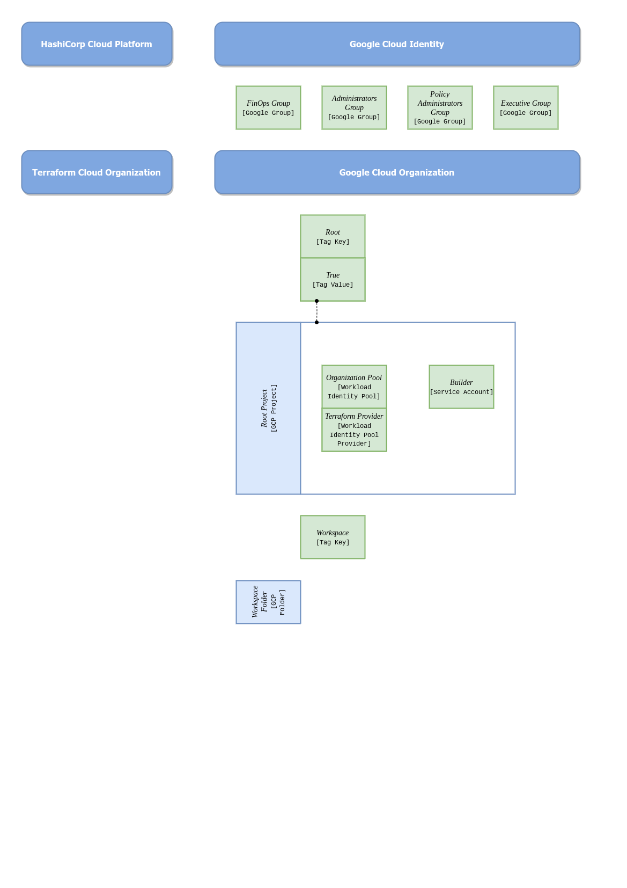

# Prolegomenous Setup Documentation

The Prolegomenous Setup client can help you create the first few building
blocks of a *root* structure in a Google Cloud organization. It is completely
automated and require only you to fill a declaration file and have a Google
account with enough permissions to build the blocks (see below).

## The *root* structure

The *psetup* client will create the following *root* structure with:

- a *root* project used for API calls for administrative tasks,
- a *workspaces* folder,
- a *builder* service account with a specific role to create workspaces within
the *workspace* folder
- a workload identity federation to delegate the usage of the *builder* service
account to a terraform Cloud organization.
- a tag key is created to bind to any future workspace created.

## Usage of the client

This client relies on a python package to create and/or update
the *root* structure described above.

- [Prerequisites](prerequisites.md)

## Reference Documentation

- Reference documentation for the python Google Cloud libraries [google-cloud-python](https://github.com/googleapis/google-cloud-python/blob/main/README.rst).
