# Prolegomenous Setup Documentation

The Prolegomenous Setup client can help you create the first few building
blocks of a *root* structure in a Google Cloud organization. It is completely
automated and require only you to fill a declaration file and have a Google
account with enough permissions to build the blocks (see below).

## The *root* structure

### Function of the *root* structure

A root structure inside a Google Cloud Organization allows you to build
complete independant workspaces for your project, each controlled by a
terraform workspace counterpart.

The *root* project allows a specific project from terraform Cloud to
authenticate to the Google Cloud Organization in order to use a *Builder*
account to set up *workspaces* inside the **Workspaces** folder. A *workspace*
is a complete unit of resources for a team to build its project autonomously.

### Organisation of the *root* structure

The *psetup* client will create the following *root* structure with:

- a *root* project used for API calls for administrative tasks,
- a *workspaces* folder,
- a *builder* service account with a specific role to create workspaces within
the *workspace* folder
- a workload identity federation to delegate the usage of the *builder* service
account to a terraform Cloud organization.
- a *workspace* tag key is created to bind to any future workspace created.

### Roles in the *root* structure

The *psetup* client relies on an *executive* group member for creation.

The *root* structure relies on three roles for usage:

- the *builder* role, for a service account to build any **workspace** in the
*Workspaces* folder.
- the *admin* role, for a group to manage the *root* structure's building blocks.
- the *viewer* role, for a group to inspect the root structure.

The *builder* role will be given to the *builder* service account of the
*root* structure. The *admin* role will be given to the *executive* group
members. The *viewer* role will be given to the *finops* and
*policy administrators* group members.

## Usage of the client

This client relies on a python package to create and/or update
the *root* structure described above.

- [Prerequisites](prerequisites.md)
- [Authentication](authentication.md)
- [Actions](actions.md)

## Reference Documentation

- Reference documentation for ...
